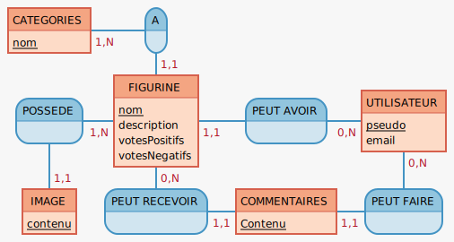

# Site communautaire de partage de figurines

## Objectif

Créer un site communautaire de partage de figurines peintes . Ce site permettra à des hobbyistes de partager à des passionnés , leurs créations et d'intéragir avec les créations d'autres membres 

Pour la V1 du site , j'ai défini ci-dessous les premières Users Stories .

---------------------------------------------

## MCD 

----------------------------------------
## MLD 

-----------------------------------------

## User Stories

| En tant que | Je souhaite |    Afin de     |
|:-------------:|:---------:|:----------------:|
| Visiteur | découvrir le site | décider de m'inscrire |
| Visiteur | m'inscrire | publier des figurines|
| Visiteur | me connecter | accéder à mon espace |
| Membre | publier des figurines | les partager |
| Membre | accéder à mon profil | afin de visualiser et/ou modifier mes informations|
| Membre | accéder à un profil d'un autre membre | afin de visualiser l'album de ce membre et ses informations |
| Membre | visualiser et gérer mon album | visualiser mes creations |
| Membre | visualiser une de mes figurines | visualiser les notes et les commentaires |
| Membre | pouvoir commenter des figurines | donner mon avis |
| Membre | pouvoir visualiser l'ensemble des figurines | découvrir toutes les créations |
| Membre | pouvoir ajouter un like ou un dislike | donner mon avis |

-----------------------------

## Routes 

* /index ( pour visiteur )
* /signup
* /login
* /home ( pour membres connectés )
* /figurines
* /figurine/:id
* /figurine/:id/addComment
* /addFigurine
* /profil
* /profil/informations
* /profil/album
* /profil/album/:figurineid
* /profil/:memberId
* /profil/:memberId/album
* /profil/:memberId/album/:figurineid

--------------------------------------
## Choix des technologies 

J'ai décidé de partir sur un Backend en Node.js avec Express et de faire une base de données relationnelle avec PostgreSQL .
Au niveau de l'architecture , je vais partir sur un modèle MVC avec l'ORM Sequelize avec une programmation en Orienté Objet et crée une API REST.

Niveau Front , je vais faire en JS Natif et je vais designer avec la libraire Bulma .

Ce site sera desktop-first ( L'ajout de Vue sur le desktop se fera une fois la V1 terminée qui sera axé davantage sur le backend ).

-----------------------------------------

## Evolutions possibles 

* Ajouter un critère Peintre Amateur , Peintre Professionel à l'inscription et à la publication
* Trier par critère les figurines , menu de filtres , champ texte de recherche en dynamique
* Ajout de Vue.js pour la partie Front
* Adapter site pour tablette
* Ajout d'une partie blog qui comprendrait des articles / tutoriel sur la peinture 
* Ajouter la modification de langue ( Anglais )
* Ajout de banderole publicitaire ( Liens d'affiliation )

